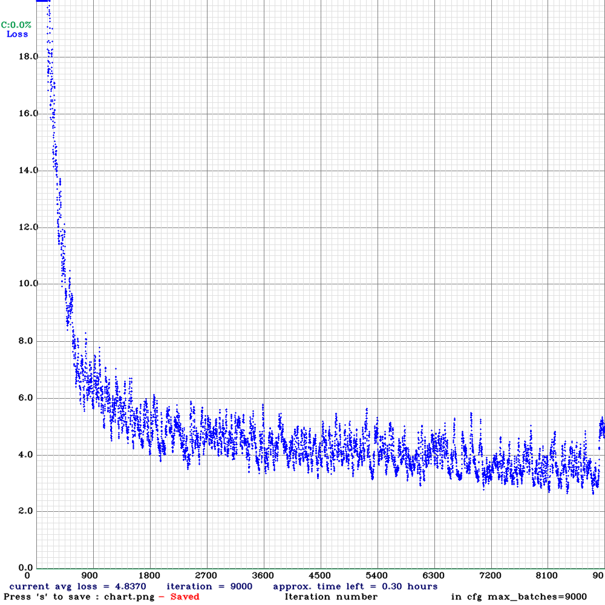
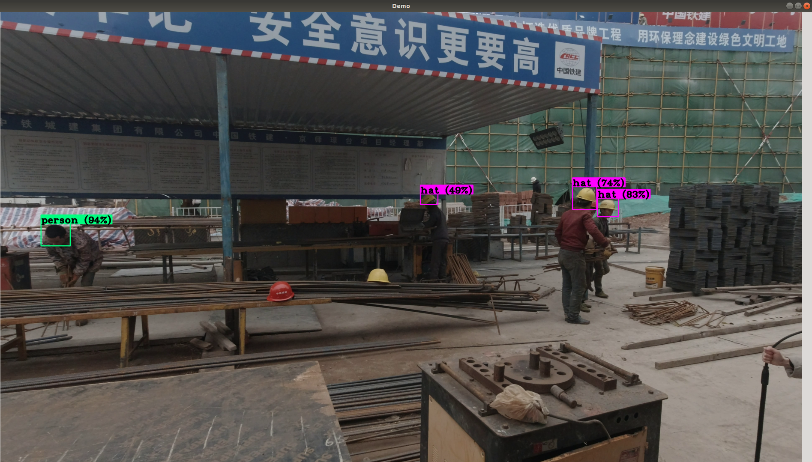

# hat_detection_v2

a project to detect if construction worker wear safety helmet

#### environment

CPU:i5-9400F

GPU:RTX3060TI

OS: ubuntu18.04

#### dataset

#### loss

#### result

about:18FPS at 1080P

#### reference

[YOLO](https://pjreddie.com/darknet/yolo/)

[darknet](https://github.com/AlexeyAB/darknet)